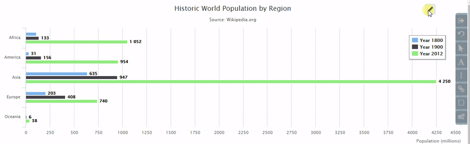

# HighchartAnnotation
Quick annotation plugin for Highcharts

Included features :-
1. Text annotation
2. Line marker
3. Area indicator

Depedency :- 
  1) Jquery 
  2) Promise polyfill for some browsers(eg. IE9) 

 
</img>

</img>
 

How to Use it:- 
Step 1 : Include script and css 
        <pre>
          //script src="./highchart.annotation.js"
          //link rel="stylesheet" href="./css/highchart.annotation.css"
        </pre>
         
Step 2 : Have following Highchart Container HTML Structure 
          <pre>
            div id="highchartContainerParent"
              div id="highchartContainer"
          </pre>
           
Step 3 : Get highchart refernece chartObj 
<pre>
        var chartObj = new Highcharts.Chart({
                      ........
                      });
                      
</pre>
 
Step 4 : Use *chartObj, *#highchartContainerParent, *enableAnnotationbutton, to create HighchartAnnotation object. 
<pre>
  new HighchartAnnotation(chartObj,toggleActionbtn,highchartContainerParent)
</pre>
